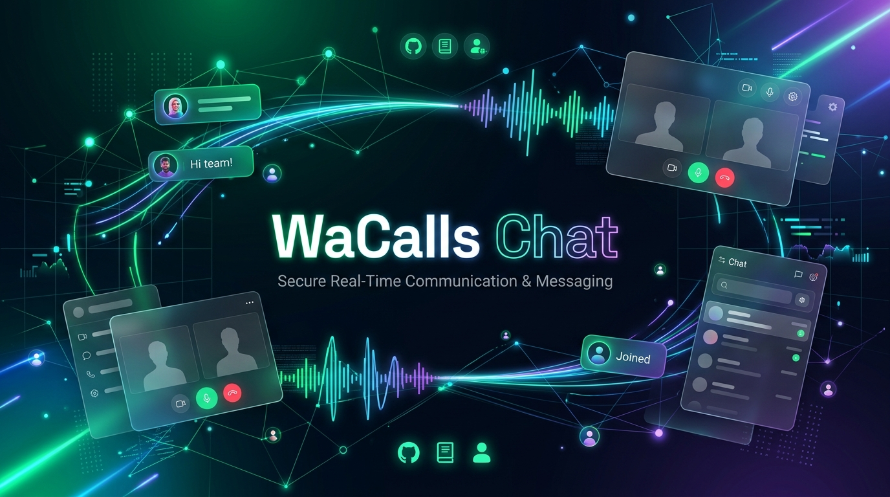

<p align="center">
  
</p>

# 📞 WaCalls Chat

> **Plataforma completa de Atendimento Multicanal, Telefonia VoIP via WebRTC, Automação de WhatsApp, Construtor Visual de Fluxos (Flow Builder), Kanban CRM e Inteligência Artificial.**

---

## 📋 Sumário

- [Visão Geral](#-visão-geral)
- [Principais Recursos](#-principais-recursos)
- [Arquitetura & Tecnologias](#-arquitetura--tecnologias)
- [Estrutura do Projeto](#-estrutura-do-projeto)
- [Pré-requisitos](#-pré-requisitos)
- [Instalação e Execução Rápida](#-instalação-e-execução-rápida)
  - [Opção 1: Script de Desenvolvimento (`dev.sh`) - Recomendado](#opção-1-script-de-desenvolvimento-devsh---recomendado)
  - [Opção 2: Via NPM Scripts](#opção-2-via-npm-scripts)
  - [Opção 3: Execução Manual em Dois Terminais](#opção-3-execução-manual-em-dois-terminais)
- [Credenciais Padrão](#-credenciais-padrão)
- [Módulos & Funcionalidades](#-módulos--funcionalidades)
  - [1. Chat Multiatendimento & WhatsApp](#1-chat-multiatendimento--whatsapp)
  - [2. Telefonia VoIP & Chamadas WhatsApp (WebRTC)](#2-telefonia-voip--chamadas-whatsapp-webrtc)
  - [3. Flow Builder (Construtor Visual de Chatbots & URAs)](#3-flow-builder-construtor-visual-de-chatbots--uras)
  - [4. Kanban & Gestão de Leads (CRM)](#4-kanban--gestão-de-leads-crm)
  - [5. Filas de Atendimento & Roteamento Inteligente](#5-filas-de-atendimento--roteamento-inteligente)
  - [6. Campanhas & Disparos em Massa](#6-campanhas--disparos-em-massa)
  - [7. Inteligência Artificial, Transcrição (STT) & Voz (TTS)](#7-inteligência-artificial-transcrição-stt--voz-tts)
  - [8. Relatórios, SLA & Métricas de Performance](#8-relatórios-sla--métricas-de-performance)
  - [9. Administração, Segurança & 2FA](#9-administração-segurança--2fa)
  - [10. Whitelabel Completo](#10-whitelabel-completo)
- [Variáveis de Ambiente (.env)](#-variáveis-de-ambiente-env)
- [Linha de Comando (Flags & Manutenção do Servidor)](#-linha-de-comando-flags--manutenção-do-servidor)
- [Deploy em Produção](#-deploy-em-produção)
- [Resolução de Problemas (Troubleshooting)](#-resolução-de-problemas-troubleshooting)
- [Licença](#-licença)

---

## 🌟 Visão Geral

O **WaCalls Chat** é uma solução completa e moderna projetada para centralizar o atendimento da sua empresa em múltiplos canais. Ele combina a mensageria do WhatsApp (via instâncias multi-dispositivo ou WhatsApp Cloud API oficial) com chamadas de voz reais via navegador (WebRTC/SIP), automações visuais inteligentes e CRM estilo Kanban.

A aplicação é dividida em:
- **Backend em Go**: Servidor leve, ultra-rápido, com baixo consumo de memória, persistência em SQLite (com modo WAL) ou suporte a Redis para instâncias distribuídas, integrações de WebRTC nativas e motor de WhatsApp Whatsmeow.
- **Frontend em React 19 + TypeScript**: Interface SPA fluida e responsiva, com suporte a temas claro/escuro, personalização Whitelabel, renderização de fluxos via React Flow e eventos em tempo real via Server-Sent Events (SSE).

---

## 🚀 Principais Recursos

- 💬 **Multi-atendimento WhatsApp em Tempo Real**: Atenda com múltiplos operadores em um único ou múltiplos números.
- 📞 **Telefonia VoIP & Chamadas Integradas**: Realize e receba ligações pelo próprio navegador com gravação automática e download protegido por URLs assinadas.
- 🔀 **Flow Builder com Nós Visuais**: Crie fluxos de atendimento, menus interativos, perguntas abertas, condições Se/Senão, randomizadores A/B e integrações HTTP/n8n.
- 📋 **Kanban CRM**: Quadros customizáveis com controle de SLA em horas, alertas de atraso e sincronização direta com as conversas.
- 👥 **Filas & Distribuição Round-Robin**: Distribuição automática e balanceada de atendimentos entre agentes disponíveis com respeito a limites de capacidade e horários de expediente.
- 📢 **Campanhas com Agendamento**: Disparos em massa com cadência segura, controle de pausas e variáveis dinâmicas (`{{nome}}`, etc.).
- 🎙️ **Transcrição de Áudio por IA**: Transcrição automática de mensagens de voz e gravações de ligações (Whisper / OpenAI / APIs compatíveis).
- 🎨 **Whitelabel Total**: Customize logo, ícones, nome da plataforma e paleta de cores.
- 🔐 **Segurança & 2FA**: Controle de permissões por perfil, autenticação de dois fatores (TOTP) e auditoria de sessões.

---

## 🛠️ Arquitetura & Tecnologias

### Backend (Go)
| Componente | Tecnologia | Descrição |
|---|---|---|
| **Linguagem** | Go (1.22+) | Alta performance, concorrência nativa e baixo uso de memória |
| **Banco de Dados** | SQLite (`modernc.org/sqlite`) | Pure-Go, sem dependência de CGO, com WAL ativado |
| **Engine WhatsApp** | `go.mau.fi/whatsmeow` | Conexão Multi-Device com suporte a QR Code e Pairing Code |
| **VoIP / WebRTC** | `github.com/pion/webrtc/v4` | Áudio em tempo real e sinalização WebRTC |
| **Tempo Real** | Server-Sent Events (SSE) | Notificações instantâneas de novas mensagens, chamadas e status |
| **Cache & Fan-out** | Memória / Redis (`go-redis/v9`) | Escalabilidade horizontal opcional com Redis |
| **Criptografia** | AES-GCM & HMAC-SHA256 | Proteção de credenciais Cloud API e links de gravações |

### Frontend (React + Vite)
| Componente | Tecnologia | Descrição |
|---|---|---|
| **Framework** | React 19 + TypeScript | Interface declarativa com tipagem estrita |
| **Build Tool** | Vite 7 | Bundler ultrarrápido com Hot Module Replacement (HMR) |
| **Estilização** | Tailwind CSS v4 + Radix UI | Componentes acessíveis, responsivos e customizáveis |
| **Flow Canvas** | `@xyflow/react` (React Flow) | Editor visual de grafos de automação e chatbot |
| **Kanban Drag-and-Drop** | `@dnd-kit/core` & `@dnd-kit/sortable` | Arraste de cards fluido e acessível |
| **State Management** | Zustand + TanStack Query v5 | Cache de requisições e gerenciamento global de estado |
| **Internacionalização** | i18next & react-i18next | Suporte multi-idioma (PT-BR, EN, ES) |
| **Gráficos & Métricas** | Recharts & Lucide Icons | Dashboards visuais e relatórios de desempenho |

---

## 📂 Estrutura do Projeto

```text
├── client/                     # Frontend da aplicação (React + Vite + TypeScript)
│   ├── src/
│   │   ├── components/         # Componentes UI (Radix, formulários, layout e domínio)
│   │   │   ├── domain/         # Componentes específicos (Chat, Flow, Kanban, Calls)
│   │   │   ├── layout/         # AppShell, Sidebar, Header
│   │   │   └── ui/             # Botões, Inputs, Dialogs, Toasters
│   │   ├── pages/              # Telas da aplicação (Chats, Kanban, Flows, Reports, etc.)
│   │   ├── stores/             # Stores Zustand (auth, tema, conexões, ligações)
│   │   ├── services/           # Comunicação com a API REST / SSE
│   │   ├── types/              # Tipos TypeScript compartilhados
│   │   └── i18n/               # Arquivos de tradução e localização
│   └── package.json            # Dependências e scripts do client
│
├── cmd/
│   ├── server/                 # Ponto de entrada do backend Go
│   │   ├── main.go             # Inicialização do servidor, flags e graceful shutdown
│   │   ├── httpapi.go          # Roteamento HTTP e Middlewares
│   │   ├── authapi.go          # Autenticação, usuários, sessões e 2FA
│   │   ├── flowexec_chat.go    # Motor de execução de fluxos de chat
│   │   ├── flowbridge.go       # Ponte entre nós de fluxo, URA e WhatsApp
│   │   ├── callregistry.go     # Gerenciamento de chamadas WebRTC ativas
│   │   ├── transcriber.go      # Integração com serviços de IA / Speech-to-Text
│   │   └── ...                 # Demais controladores e serviços internos
│   └── migrate/                # Utilitários de migração de banco
│
├── internal/
│   ├── cache/                  # Camada de cache (em memória ou Redis)
│   ├── storage/                # Abstração de conexão SQLite / DB
│   ├── voip/                   # Lógica de telefonia, RTP e áudio
│   └── wa/                     # Wrapper do cliente WhatsApp whatsmeow
│
├── media/                      # Armazenamento de áudios, gravações e mídias
├── dev.sh                      # Script completo de desenvolvimento e build
├── instalador.sh               # Script de instalação automatizada para Linux/VPS
├── go.mod / go.sum             # Dependências do backend Go
├── package.json                # Gerenciador raiz para orquestração de scripts
└── wacalls.db                  # Banco de dados SQLite padrão
```

---

## 💻 Pré-requisitos

Antes de iniciar, certifique-se de possuir em seu ambiente:

- **Node.js**: Versão 20 LTS ou superior ([Download](https://nodejs.org/))
- **NPM**: Versão 10 ou superior
- **Go**: Versão 1.22 ou superior ([Download](https://go.dev/dl/))
- **Git**: Para clonagem e versionamento ([Download](https://git-scm.com/))

---

## ⚡ Instalação e Execução Rápida

### Opção 1: Script de Desenvolvimento (`dev.sh`) - Recomendado

O projeto inclui o script utilitário `dev.sh` com verificações automáticas de portas e dependências.

```bash
# 1. Dar permissão de execução
chmod +x dev.sh

# 2. Iniciar backend + frontend juntos
./dev.sh
```

**Comandos adicionais do `dev.sh`:**
```bash
./dev.sh --help       # Exibe ajuda e opções
./dev.sh --setup      # Apenas instala as dependências (Go + Node)
./dev.sh --server     # Inicia apenas o backend Go
./dev.sh --client     # Inicia apenas o frontend Vite
./dev.sh --build      # Compila frontend e gera binário de produção
./dev.sh --clean      # Limpa arquivos de build e caches temporários
```

---

### Opção 2: Via NPM Scripts

Na raiz do projeto:

```bash
# 1. Instalar dependências da raiz e do frontend
npm install
npm run setup

# 2. Executar frontend e backend simultaneamente
npm run dev
```

---

### Opção 3: Execução Manual em Dois Terminais

Se preferir acompanhar os logs de backend e frontend separadamente:

#### Terminal 1 — Backend (Go)
```bash
go mod download
go run ./cmd/server -addr :3001 -debug
```

#### Terminal 2 — Frontend (Vite)
```bash
cd client
npm install
npm run dev
```

Acesse no navegador: **`http://localhost:5173`**

---

## 🔑 Credenciais Padrão

Ao iniciar a aplicação pela primeira vez, o administrador padrão será criado automaticamente:

| Campo | Valor Padrão |
|---|---|
| **E-mail** | `wacalls@admin.com` *(ou `admin@equipechat.com`)* |
| **Senha** | `admin` *(ou `adminpro`)* |

> ⚠️ **IMPORTANTE**: Altere a senha padrão imediatamente após o primeiro login na tela de **Usuários & Perfil**.

---

## 📦 Módulos & Funcionalidades

### 1. Chat Multiatendimento & WhatsApp
- **Sessões Multi-Dispositivo**: Conecte múltiplos números WhatsApp via QR Code ou Código de Pareamento de 8 dígitos.
- **WhatsApp Cloud API**: Conexão com a API oficial da Meta (Cloud API) com webhooks protegidos por assinatura.
- **Mensagens Apagadas Ocultas**: Mensagens revogadas/apagadas pelo remetente são automaticamente removidas das threads e prévias.
- **Respostas Rápidas (`/atalhos`)**: Crie modelos de respostas com variáveis dinâmicas (`{{nome}}`, `{{protocolo}}`, `{{atendente}}`) e **anexos de mídia** (imagem, vídeo, documento, áudio até 32 MB).
- **Mensagens Agendadas**: Programe envios com data e hora específicas.
- **Follow-up Automático**: Configure lembretes que se cancelam sozinhos caso o cliente responda antes do tempo programado.
- **Assinatura do Atendente**: Inclusão automática do nome do operador no final de cada mensagem enviada.
- **Tags & Organização**: Aplique etiquetas coloridas para classificar leads e conversas.

---

### 2. Telefonia VoIP & Chamadas WhatsApp (WebRTC)
- **Discador Integrado**: Ligue diretamente pelo painel para números reais ou contatos do WhatsApp (formato E.164).
- **Atendimento de Chamadas**: Receba notificações sonoras e atenda chamadas de voz do WhatsApp pelo navegador.
- **Gravação Automática**: Gravação em tempo real das chamadas em formato Opus/WAV.
- **Player de Áudio & Links Seguros**: Ouça gravações diretamente no histórico com proteção HMAC-SHA256 para links com tempo de expiração.
- **Barra de Chamada Persistente**: Controles globais na interface para Mudo (Mute), Espera (Hold Music) e Desconexão.

---

### 3. Flow Builder (Construtor Visual de Chatbots & URAs)
Editor visual no estilo no-code/low-code baseado em nós conectados:

```
[Início] ──> [Menu de Opções] ──┬─ (1: Vendas)  ──> [Fila: Comercial]
                                ├─ (2: Suporte) ──> [Se/Senão: Horário] ──> [Atendente]
                                └─ (3: Outros)  ──> [Requisição HTTP / n8n]
```

#### Catálogo de Nós Suportados:
- **Conteúdo**:
  - `Texto`: Envia mensagens simples com suporte a variáveis.
  - `Conteúdo / Mídia`: Envio de fotos, vídeos, áudios e documentos.
- **Interação**:
  - `Menu`: Envia menu numerado e aguarda escolha do cliente.
  - `Msg Interativa`: Botões nativos do WhatsApp (até 3) ou listas interativas.
  - `Pergunta Aberta`: Aguarda digitação do cliente e grava o valor em uma variável personalizada.
  - `Intervalo`: Pausa estratégica (delay de digitação) antes do próximo bloco.
- **Lógica**:
  - `Se / Senão`: Bifurcação condicional com operadores (igual, contém, começa com, etc.).
  - `Randomizador`: Distribuição de tráfego percentual (testes A/B).
- **Sistema**:
  - `Fila`: Encaminha o atendimento para um setor/departamento específico.
  - `Marcar Tag` / `Remover Tag`: Altera etiquetas do contato em tempo real.
  - `Trocar Fluxo`: Transfere a conversa para outro fluxo configurado.
- **Integrações**:
  - `Variável`: Define valores no contexto da sessão.
  - `Requisição HTTP`: Executa chamadas REST (GET, POST, PUT, DELETE) e mapeia os retornos JSON para variáveis do chat.
  - `n8n Webhook`: Disparo direto para workflows no n8n.
- **Simulador Integrado**: Teste a lógica do chatbot na própria tela antes de ativar em produção.

---

### 4. Kanban & Gestão de Leads (CRM)
- **Múltiplos Quadros**: Crie quadros para Vendas, Pós-Venda, Suporte, etc.
- **Colunas Customizáveis**: Configure etapas personalizadas com cores e limites.
- **SLA por Etapa**: Defina tempo máximo (em horas) para permanência em cada coluna, com alerta visual caso o card esteja atrasado.
- **Sincronização com o Chat**: Crie cards diretamente da conversa e acesse o histórico do lead com um clique.

---

### 5. Filas de Atendimento & Roteamento Inteligente
- **Distribuição Round-Robin**: Distribuição equilibrada de novos atendimentos entre operadores disponíveis.
- **Controle de Carga**: Definição de quantidade máxima de atendimentos simultâneos por agente.
- **Horário de Atendimento**: Definição de expediente por fila com envio automático de mensagens de ausência fora do horário.

---

### 6. Campanhas & Disparos em Massa
- **Segmentação por Tags e Listas**: Dispare para grupos específicos de contatos.
- **Anti-Bloqueio**: Configuração de intervalos dinâmicos (delays aleatórios) entre mensagens.
- **Relatórios de Envio**: Métricas de mensagens enviadas, entregues, lidas e falhas.

---

### 7. Inteligência Artificial, Transcrição (STT) & Voz (TTS)
- **Speech-to-Text (STT)**: Transcreve áudios recebidos de clientes e gravações de chamadas para texto pesquisável. Compatível com OpenAI Whisper e modelos locais.
- **Text-to-Speech (TTS)**: Síntese de voz com Piper ou serviços compatíveis para mensagens faladas na URA.

---

### 8. Relatórios, SLA & Métricas de Performance
- **Dashboard em Tempo Real**: Total de atendimentos, chamadas ativas e conversas em fila.
- **Métricas de SLA**: Tempo Médio de Primeira Resposta (TMR) e Tempo Médio de Atendimento (TMA).
- **Pesquisa de Satisfação (CSAT)**: Coleta e tabulação de notas enviadas pelos clientes ao término do atendimento.
- **Ranking de Atendentes**: Produtividade e avaliações individuais por operador.

---

### 9. Administração, Segurança & 2FA
- **Perfis de Acesso**: Permissões granulares para Administradores, Supervisores e Agentes.
- **Autenticação 2FA / TOTP**: Suporte a Google Authenticator, Authy e apps compatíveis com chave OTP e QR Code.
- **Recuperação de Senha por E-mail**: Configuração de servidor SMTP dedicado com tokens seguros temporários.

---

### 10. Whitelabel Completo
Personalize a identidade da plataforma:
- Nome da aplicação e nome reduzido mobile.
- Logomarcas personalizadas para temas Claro e Escuro.
- Favicon e ícone do app.
- Cores primárias da interface e links de suporte / termos de uso.

---

## ⚙️ Variáveis de Ambiente (.env)

O backend pode ser customizado através de variáveis de ambiente:

```bash
# ==============================================================================
# SERVIDOR E BANCO DE DADOS
# ==============================================================================
WACALLS_ADDR=:8080                     # Porta de escuta do backend (padrão :8080)
WACALLS_DB=wacalls.db                 # Caminho do arquivo SQLite
WACALLS_DEBUG=false                   # Ativar logs detalhados (true/false)
DB_DRIVER=sqlite                      # Driver do banco (sqlite)
REDIS_URL=redis://127.0.0.1:6379/0    # URL do Redis (opcional, para fanout/cluster)

# ==============================================================================
# SEGURANÇA E CRIPTOGRAFIA
# ==============================================================================
SESSION_SECRET=minha-chave-secreta-forte-aqui     # Chave para criptografia de sessões e Cloud API
RECORDING_SIGNING_KEY=chave-hmac-para-gravacoes    # Chave para assinatura de URLs de áudio

# ==============================================================================
# TRANSCRIÇÃO DE ÁUDIO (STT - SPEECH TO TEXT)
# ==============================================================================
WACALLS_STT_URL=https://api.openai.com/v1/audio/transcriptions
WACALLS_STT_AUTH=Bearer sk-proj-seu-token-openai
WACALLS_STT_MODEL=whisper-1
WACALLS_STT_LANG=pt
WACALLS_STT_MODE=multipart            # "multipart" (OpenAI) ou "raw"

# ==============================================================================
# SÍNTESE DE VOZ (TTS - TEXT TO SPEECH)
# ==============================================================================
WACALLS_TTS_URL=http://127.0.0.1:5005/api/tts
WACALLS_TTS_AUTH=
WACALLS_TTS_VOICE=pt_BR-faber-medium

# ==============================================================================
# SAUDAÇÃO DE BOAS-VINDAS NO PAREAMENTO
# ==============================================================================
WACALLS_WELCOME=on                    # "on" para enviar saudação no pareamento, "off" para desligar
WACALLS_WELCOME_MESSAGE=✅ WhatsApp conectado com sucesso!
```

---

## 💻 Linha de Comando (Flags & Manutenção do Servidor)

O binário do servidor Go possui flags utilitárias para manutenção direta:

```bash
# Executar o servidor com endereço e banco customizados
./server -addr :3001 -db /var/data/wacalls.db -debug

# Listar todos os usuários cadastrados no banco
./server -db wacalls.db -list-users

# Redefinir ou criar um administrador via linha de comando
./server -db wacalls.db -reset-admin-email "admin@meudominio.com" -reset-admin-password "NovaSenha123"

# Especificar pasta estática da build do frontend
./server -static ./client/dist
```

---

## 🚀 Deploy em Produção

### 1. Build do Frontend
```bash
cd client
npm install
npm run build
cd ..
```
Isso gerará os arquivos estáticos na pasta `client/dist` (ou `dist`).

### 2. Build do Backend Go
```bash
go build -ldflags="-s -w" -o wacalls-server ./cmd/server
```

### 3. Exemplo de Serviço Systemd (`/etc/systemd/system/wacalls.service`)
```ini
[Unit]
Description=WaCalls Chat Server
After=network.target

[Service]
Type=simple
User=www-data
WorkingDirectory=/opt/wacalls
ExecStart=/opt/wacalls/wacalls-server -addr :8080 -db /opt/wacalls/wacalls.db
Restart=always
RestartSec=5
Environment=SESSION_SECRET=umaChaveMuitoLongaESegura123456
Environment=WACALLS_WELCOME=off

[Install]
WantedBy=multi-user.target
```

### 4. Configuração Reversa Nginx (com WebSockets e SSE)
```nginx
server {
    server_name chat.seudominio.com;

    location / {
        proxy_pass http://127.0.0.1:8080;
        proxy_http_version 1.1;
        proxy_set_header Upgrade $http_upgrade;
        proxy_set_header Connection "upgrade";
        proxy_set_header Host $host;
        proxy_set_header X-Real-IP $remote_addr;
        proxy_set_header X-Forwarded-For $proxy_add_x_forwarded_for;
        proxy_set_header X-Forwarded-Proto $scheme;

        # Configurações essenciais para SSE (Server-Sent Events)
        proxy_buffering off;
        proxy_cache off;
        proxy_read_timeout 86400s;
    }
}
```

---

## ❓ Resolução de Problemas (Troubleshooting)

| Sintoma | Causa Mais Provável | Como Resolver |
|---|---|---|
| `vite: command not found` | Dependências do client não instaladas | Execute `npm run setup` ou `npm install` na pasta `client/` |
| `proxy error: /api/... ECONNREFUSED` | Backend Go não está em execução | Inicie o backend com `./dev.sh` ou `go run ./cmd/server` |
| Login rejeitado com admin padrão | Banco existente já possui credenciais salvas | Redefina com `-reset-admin-email` ou apague `wacalls.db*` para recriar o banco |
| Mensagens SSE não chegam em tempo real | Buffer ativado no Nginx ou proxy reverso | Adicione `proxy_buffering off;` na configuração do Nginx |
| Gravação de chamadas sem áudio | Microfone sem permissão no navegador ou WebRTC bloqueado | Conceda permissão de microfone e verifique se o site roda sob HTTPS |
| Áudio de URA mudo no fluxo | Serviço de TTS (Piper) indisponível | Verifique se a URL em `WACALLS_TTS_URL` está acessível |

---

## 📄 Licença

Este projeto é distribuído sob os termos da licença incluída no arquivo [LICENSE](LICENSE).

---

<div align="center">
  <sub>Desenvolvido com foco em alta performance, estabilidade e experiência do usuário.</sub>
</div>
